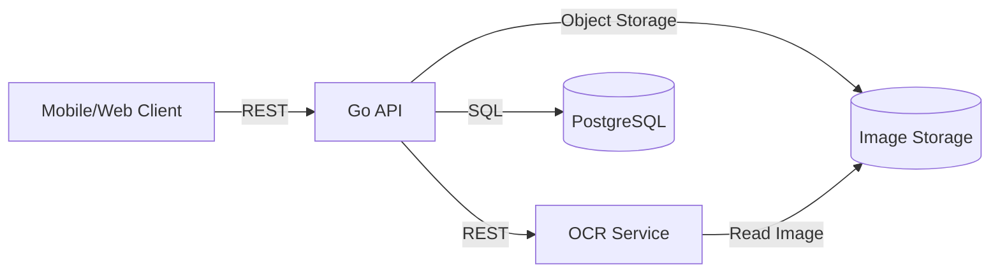
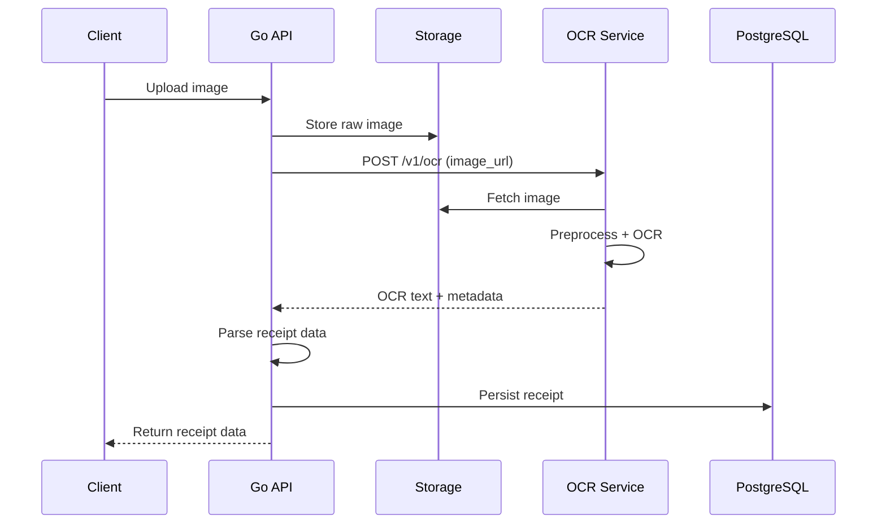

# Architecture Overview

## Scope
This repository contains two services and supporting infrastructure:
- Go API: auth, upload, receipt management, OCR result parsing, validation, persistence.
- OCR Service (FastAPI): image preprocessing + OCR extraction.
- PostgreSQL: persistence and queries.

## High-Level Components
- `services/go-api`: main business service.
- `services/ocr-service`: stateless OCR worker service.
- `infra/`: container build and deployment assets.
- `docs/`: documentation and runbooks.

## Backend Service Architecture

## Data Flow Antar Service

## Layering (Go API Clean Architecture)
- Domain: entities, repository interfaces, business rules.
- Application: use cases, orchestration, validation.
- Infrastructure: DB adapters, external clients.
- Transport: HTTP handlers, routing, DTO mapping.

## Where to Read More
- OCR pipeline: `docs/ocr-pipeline.md`
- Receipt parsing: `docs/receipt-parsing.md`
- Performance and scaling: `docs/performance.md`
- Logging and monitoring: `docs/operations.md`
- Security: `docs/security.md`
