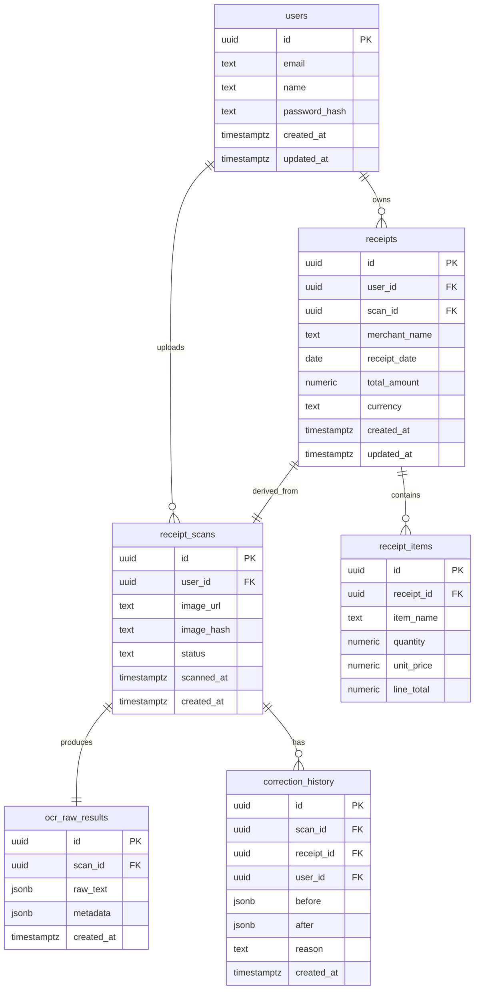

# Database Design (PostgreSQL)

## Overview
Database menyimpan data user, hasil scan OCR, receipt terstruktur, item receipt, raw OCR, dan histori koreksi. Skema dirancang agar:
- Memisahkan data mentah (OCR) dan data terstruktur (receipt + items).
- Mendukung re-processing tanpa OCR ulang.
- Mendukung audit trail untuk koreksi user.

## ER Diagram (Ringkas)



## Tabel dan Penjelasan

### 1) `users`
Menyimpan akun pengguna.

**Field utama**
- `id` (UUID, PK)
- `email` (unique)
- `name`
- `password_hash`
- `created_at`, `updated_at`

**Alasan desain**
Memisahkan identitas pengguna dari receipt untuk audit dan multi-tenant.

---

### 2) `receipt_scans`
Menyimpan metadata scan gambar struk (sebelum parsing).

**Field utama**
- `id` (UUID, PK)
- `user_id` (FK -> users)
- `image_url`
- `image_hash` (untuk dedup)
- `status` (uploaded, ocr_processing, parsed, failed)
- `scanned_at`
- `created_at`

**Alasan desain**
Memisahkan proses scan dari receipt final. Memudahkan retry OCR dan audit.

---

### 3) `ocr_raw_results`
Menyimpan hasil OCR mentah dan metadata.

**Field utama**
- `id` (UUID, PK)
- `scan_id` (FK -> receipt_scans)
- `raw_text` (JSONB atau TEXT)
- `metadata` (JSONB: confidence, bounding boxes)
- `created_at`

**Alasan desain**
Raw OCR disimpan agar parsing bisa diulang tanpa OCR ulang.

---

### 4) `receipts`
Data receipt terstruktur hasil parsing.

**Field utama**
- `id` (UUID, PK)
- `user_id` (FK -> users)
- `scan_id` (FK -> receipt_scans, unique)
- `merchant_name`
- `receipt_date`
- `total_amount`
- `currency`
- `created_at`, `updated_at`

**Alasan desain**
Receipt dipisah dari scan sehingga user bisa koreksi hasil parsing tanpa kehilangan raw OCR.

---

### 5) `receipt_items`
Line items untuk setiap receipt.

**Field utama**
- `id` (UUID, PK)
- `receipt_id` (FK -> receipts)
- `item_name`
- `quantity`
- `unit_price`
- `line_total`

**Alasan desain**
Mendukung query item-level, analytics, dan validasi total.

---

### 6) `correction_history`
Menyimpan histori perubahan receipt hasil koreksi user.

**Field utama**
- `id` (UUID, PK)
- `scan_id` (FK -> receipt_scans)
- `receipt_id` (FK -> receipts)
- `user_id` (FK -> users)
- `before` (JSONB)
- `after` (JSONB)
- `reason`
- `created_at`

**Alasan desain**
Audit trail dan rollback perubahan data receipt.

---

## Relasi Antar Tabel
- `users` 1..* `receipt_scans`
- `users` 1..* `receipts`
- `receipt_scans` 1..1 `ocr_raw_results`
- `receipt_scans` 1..1 `receipts`
- `receipts` 1..* `receipt_items`
- `receipt_scans` 1..* `correction_history`

## Indexing Strategy
- `users(email)` unique untuk login.
- `receipt_scans(user_id, created_at)` untuk list history user.
- `receipt_scans(image_hash)` untuk dedup scan.
- `receipts(user_id, created_at)` untuk query receipt history.
- `receipts(scan_id)` unique untuk menjaga 1:1 dengan scan.
- `receipt_items(receipt_id)` untuk join cepat.
- `correction_history(receipt_id, created_at)` untuk audit per receipt.

## Contoh Query Umum

### 1) List receipts terbaru user
```sql
SELECT r.id, r.merchant_name, r.receipt_date, r.total_amount
FROM receipts r
WHERE r.user_id = $1
ORDER BY r.created_at DESC
LIMIT 20;
```

### 2) Get receipt detail + items
```sql
SELECT r.*, i.item_name, i.quantity, i.unit_price, i.line_total
FROM receipts r
JOIN receipt_items i ON i.receipt_id = r.id
WHERE r.id = $1;
```

### 3) Find duplicate scan by image hash
```sql
SELECT id, user_id, created_at
FROM receipt_scans
WHERE image_hash = $1;
```

### 4) Audit correction history
```sql
SELECT c.before, c.after, c.reason, c.created_at
FROM correction_history c
WHERE c.receipt_id = $1
ORDER BY c.created_at DESC;
```

## Desain Schema Notes
- Gunakan UUID untuk semua PK agar aman saat scaling horizontal.
- `jsonb` dipilih untuk menyimpan raw OCR dan audit payload karena fleksibel.
- `scan_id` di `receipts` dibuat unique agar 1 scan menghasilkan 1 receipt final.
