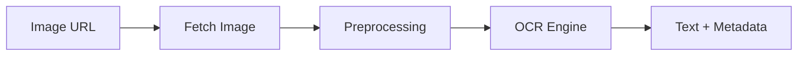

# OCR Pipeline

## Overview
OCR pipeline bertanggung jawab mengubah gambar struk menjadi teks mentah yang dapat diparse oleh Go API. Pipeline ini bersifat stateless dan dikemas dalam OCR service (FastAPI).

## OCR Processing Pipeline Diagram

## Stages
- Fetch Image: OCR service menarik image dari storage berdasarkan URL yang diberikan Go API.
- Preprocessing: normalisasi untuk meningkatkan akurasi OCR.
- OCR Engine: menjalankan engine OCR (PaddleOCR placeholder).
- Output: teks mentah + metadata (confidence, bounding boxes jika tersedia).

## Error Handling Strategy
- Input error: image_url invalid atau tidak bisa diakses.
- Processing error: preprocessing failure, OCR engine error.
- Output error: response kosong atau format tidak sesuai.

## Performance Considerations
- Batasi ukuran image maksimal.
- Gunakan cache hasil OCR jika image hash sama.
- Jalankan OCR engine dengan thread pool terbatas untuk mencegah over-commit CPU.
