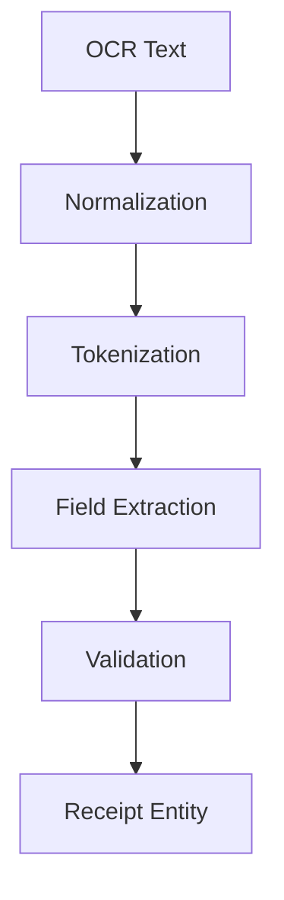

# Receipt Parsing Architecture

## Overview
Parsing mengubah teks mentah OCR menjadi data receipt terstruktur. Parsing dilakukan di Go API karena berkaitan dengan domain logic (line items, totals, taxes, merchant info).

## Receipt Parsing Flow

## Parsing Steps
- Normalization: trim whitespace, unify decimal, date normalization.
- Tokenization: pecah per baris dan kolom.
- Field Extraction: merchant, date, total, tax, line items.
- Validation: cek total, cek item sum, cek date format.
- Receipt Entity: siap disimpan ke DB.

## Error Handling Strategy
- Soft errors: field tidak ditemukan, default ke null dan tandai untuk review user.
- Hard errors: parsing crash atau data invalid secara fatal.
- Audit: simpan raw OCR text untuk debug.

## Extensibility
- Tambah parser per merchant.
- Tambah rules untuk locale/currency.
